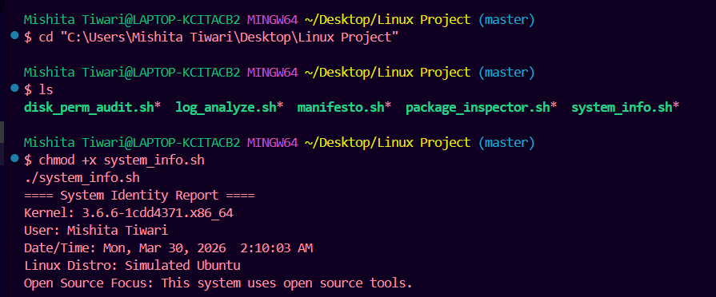

# OSS Audit — VLC Media Player

## Student Details
- **Name:** Mishita Tiwari 
- **Roll Number:** 24BAI10204
- **Course:** B.Tech CSE (AI/ML), VIT Bhopal  

---

## Project Description
This project is an **Open Source Software (OSS) audit** of VLC Media Player.  
It includes **5 bash scripts** to simulate Linux auditing:

1. **system_info.sh** — Shows system info like kernel, user, and date.  
2. **package_inspector.sh** — Checks if VLC is installed (simulated).  
3. **disk_perm_audit.sh** — Displays disk usage and folder permissions.  
4. **log_analyze.sh** — Searches system logs for errors (simulated).  
5. **manifesto.sh** — Generates a small OSS manifesto from user input.  

> The scripts are run in **PowerShell or Git Bash** simulating Linux behavior on Windows.  

---

## Folder Structure

```text
linux_project/
│
├── system_info.sh
├── package_inspector.sh
├── disk_perm_audit.sh
├── log_analyze.sh
├── manifesto.sh
├── report.pdf
└── screenshots/
    ├── system_info.png
    ├── package_inspector.png
    ├── disk_perm_audit.png
    ├── log_analyze.png
    └── manifesto.png
How to Run the Scripts
Open PowerShell or Git Bash in this folder:
cd "C:/path/to/linux_project"
Make all scripts executable (only needed in Git Bash):
chmod +x *.sh
Run each script:
./system_info.sh
./package_inspector.sh
./disk_perm_audit.sh
./log_analyze.sh
./manifesto.sh
For manifesto.sh, type any example input when prompted.

## Screenshots

**system_info.sh Output**  


**package_inspector.sh Output**  


**disk_perm_audit.sh Output**  


**log_analyze.sh Output**  


**manifesto.sh Output**  
